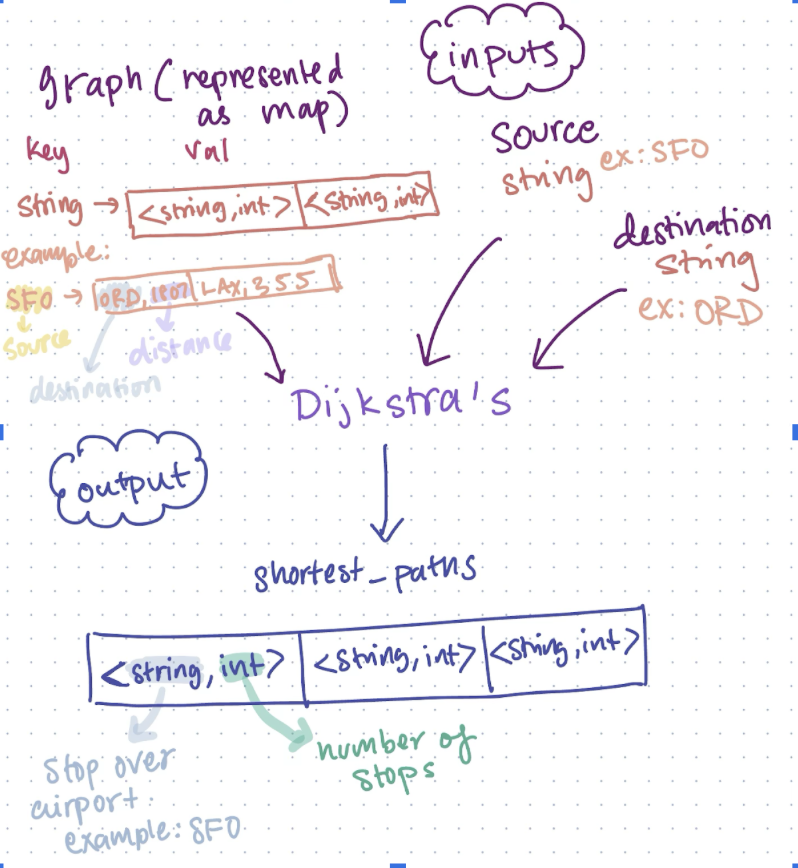
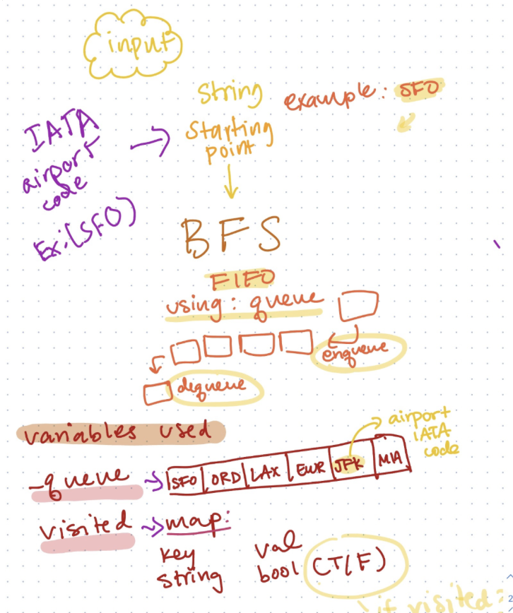
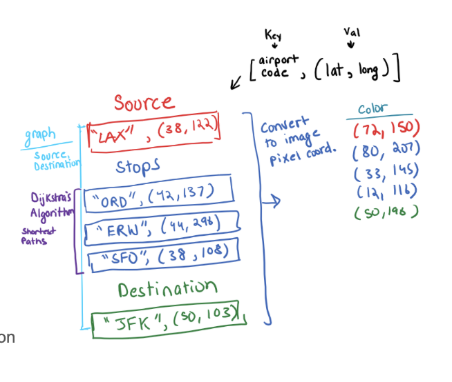

# teamZero 

Ruhi Choudhury, Sam Madhan, Akash Sannasi 

## **Overview**

Our goal is to inspire people to see their options when flying to a place in a graphical and quick way. We are using BFS and Dijkstra’s algorithm to provide a graphical output to the user about the most efficient paths they can take to their destination.

As we strategized and planned our code, we realized the multitude of ways there are to execute each goal. It increased our appreciation of the versatile nature of graphs and data structures. For example, when discussing how to represent our graph we decided on a map. We chose this because at the time we felt like it was the best way to represent our data. However, after looking back and absorbing concepts from our 225 lecture, we recognize that an adjacency matrix would have been a more optimal approach. This would save time since finding edges would have taken O(n) instead of O(n^2). A similar pattern followed for our algorithms. We wrote them in the way we felt was most efficient. But now we have a better understanding of the fact that the efficiency of an algorithm sometimes depends on the use case. 

We found the map output algorithm challenging. We figured out how to print the airports on the map in the correct colors, and correct relative distances from each other. However, they are being printed a little too left. We wrote multiple test cases to try to debug it but couldn't find the error even after checking longitudes and latitudes being put in. It seems to be a mathematical conversion being wrong. For now, our code does output the correct airports, but our map output draws them a little off. If we had more time, we would work on fixing this issue.

Finally, we learnt the importance of writing test cases. Sometimes our algorithm would work with a simple test case. But as we added more airports or routes, the test case would fail. Here it really helped to have simpler test cases to fall back on. It helped us identify the aspects that worked and didn't work. It also made us more aware of edge cases and things to look out for. Overall, writing our own test cases made us appreciate a bottom up approach to debugging code and solving problems.

## **Algorithms**

## Dijkstra’s 

### Summary: We use Dijkstra's algorithm to find direct and one stop flights from a source to a destination airport. Our dijkstra’s class takes in our graph, wrote one test case where there are both 0 and 1 stops between two airports. For this test case we ensured that the destinations and stops in the output are correct. We wrote a second test case with no direct flights, only source, and destination (represented in diagram below). O(nodes + edges).

### Tests: We wrote tests for common and edge cases for this algorithm. We stopovers. This was to ensure that the algorithm was able to still find the shortest paths and correctly identify the number of stops. Finally, we wrote an edge case that checks if the algorithm can identify when incorrect input is fed to it and/or no routes exist.

### Diagram:

## BFS

### Summary: We used breadth-first search to identify all the airports in our dataset and check whether all the airports were being inputted into our graph. This allows us to traverse the graph for airports. Its argument is the airport source IATA code (Ex: SFO or ORD) we want to start traversing BFS from. O(n).

### Tests: We tested by comparing the saved vector of airport IATA codes from the BFS algorithm with those returned from a for loop through the map. We did this multiple times with a small-sized and medium-sized dataset. Our BFS is also checked when we check our graph for correctly taking in the routes and airport data we pass into it. We also checked if the airport is valid or in the graph. 

### Diagram:

## Map Output

### Summary: The Map output  function takes in an empty map of the world and draws the source airport, destination airport, and stops based on the route passed into the output constructor.  The source is colored in red, the destination in green, and any  potential stops in blue. If the airports passed into the constructor do not exist in the graph, nothing is outputted to the map. O(n^2) for pixel coloring.

### Tests: We tested the function by calculating the pixel coordinates at which the corresponding airports would be colored and checking that they are changed to the appropriate color depending on whether the airport is a source, destination, or stop. For a map that should remain empty, we iterate through every pixel in the image and check that it is equal to the pixels of an empty map.

### Diagram: 

